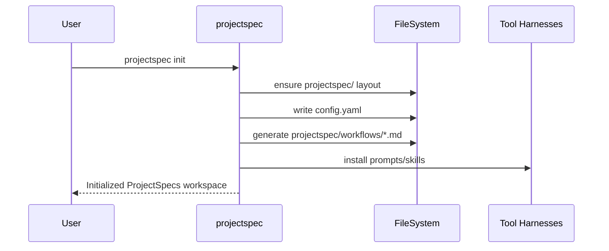
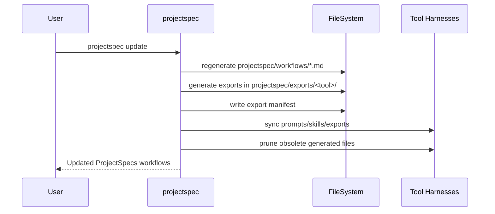
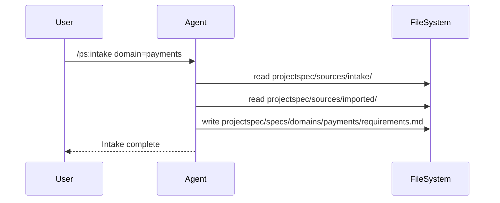
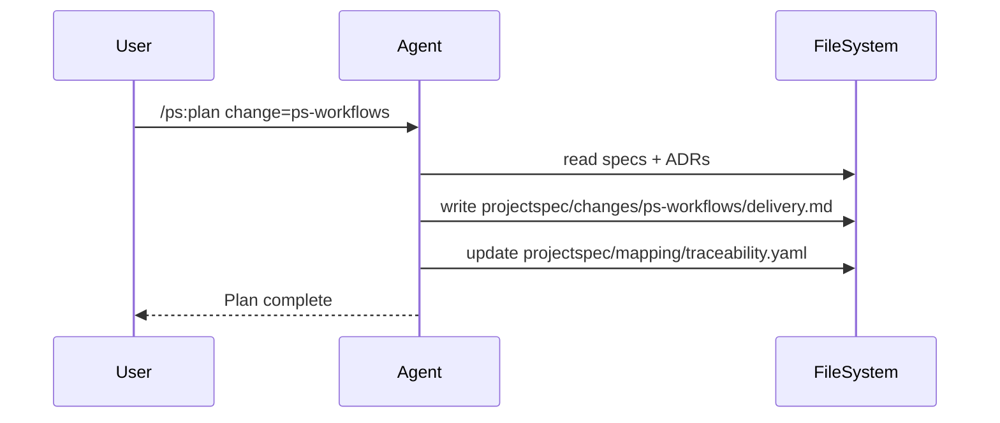
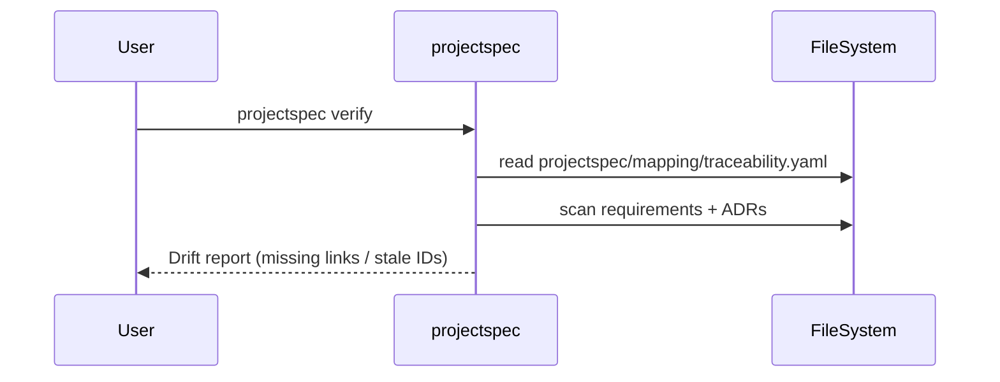

  

# ProjectSpecs Architecture

This document describes how the ProjectSpecs CLI and agent workflows operate today and how they are intended to evolve.

## CLI Responsibilities

- Initialize a canonical `projectspec/` workspace.
- Install workflow prompts and skills for supported tools.
- Generate and prune tool exports.
- Validate traceability drift.

## Runtime Components

- **CLI**: `projectspec` command (Node.js, TypeScript).
- **Project workspace**: `projectspec/` folder as source of truth.
- **Workflows**: agent-driven /ps:* prompts.
- **Exports**: tool-specific bundles and manifests.

## Data Flow Summary

- Inputs (raw and imported) are curated into specs.
- Architecture decisions update context and ADRs.
- Plans produce delivery artifacts and traceability links.
- Exports generate tool-ready bundles.
- Verify reports drift across requirements and decisions.
- Archive snapshots completed changes.

## Sequence Diagrams

### Initialization

### Update (Workflows + Exports)

### /ps:intake Workflow

### /ps:plan Workflow

### /ps:verify Workflow

## Future Architecture Work

- Read-only integrations for Jira/Confluence/GitHub Projects into `projectspec/sources/imported/`.
- Stronger traceability utilities for REQ/ADR/INT/CHG IDs.
- Export manifests with provenance and bundle metadata.
- Drift verification across integrations and contracts.

See `docs/imports.md` for the import pipeline and registry format.
