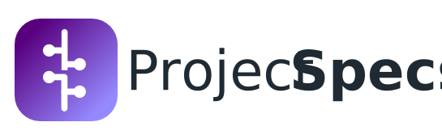

  

# ProjectSpecs Overview

ProjectSpecs is a lightweight, AI-native project specification layer that turns enterprise requirements and architecture artifacts into structured, traceable project specs consumable by humans and AI assistants.

## Goals

- Keep a single, local source of truth for project specs.
- Enable traceability from requirements to work items and tests.
- Support AI tools with structured, human-readable artifacts.

## Non-Goals

- Replacing Jira/Confluence/ADO or acting as a PM suite.
- Enforcing a single SDLC or governance model.
- Building a UI in the initial phase.

## How to use this repo

This repo hosts the CLI and default workflow scaffolding for ProjectSpecs. Use the CLI to initialize a project and generate workflow artifacts.

For user-facing commands and flags, see the CLI package README.
